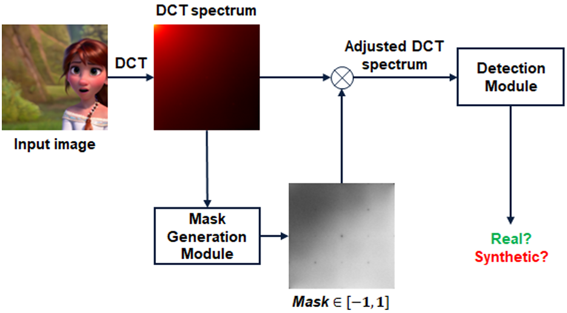

# Detecting Stable Diffusion Generated Images Using Frequency Artifacts: A Case Study on Disney-Style Art

This is the repository for paper [Detecting Stable Diffusion Generated Images Using Frequency Artifacts: A Case Study on Disney-Style Art](https://ieeexplore.ieee.org/abstract/document/10221905) accepted to ICIP 2023.

## Datasets

The dataset we constructed in Section 3.1 of our paper can be downloaded [here](https://www.dropbox.com/scl/fi/vyk9bi7df6hp46md6mkxg/DisneyDataset.zip?rlkey=4wrahu4usf6g372lhyhdh8bmj&st=wnia1liw&dl=0).

## Checkpoints

Our trained models can be found [here](./checkpoints/ours.pth).